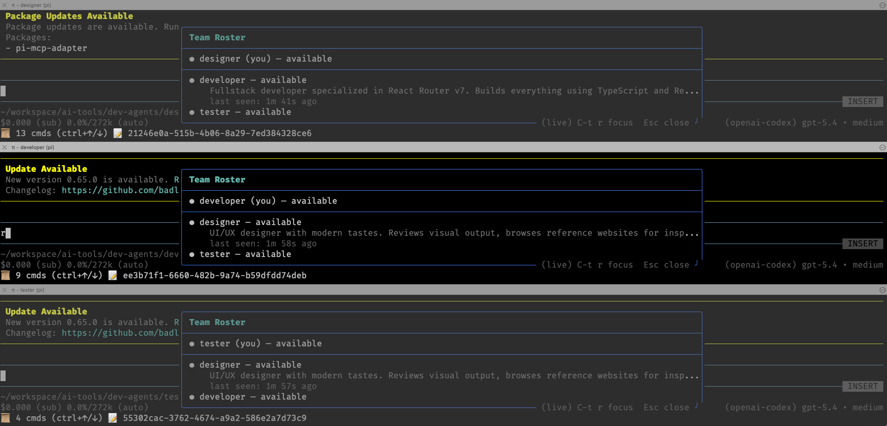
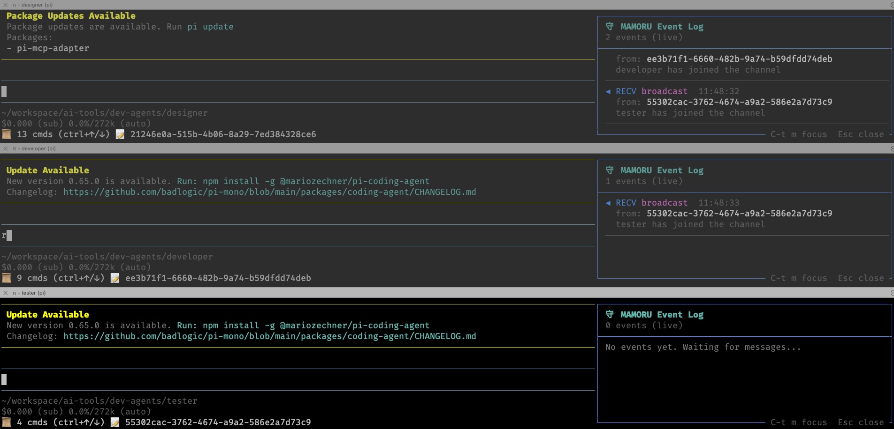
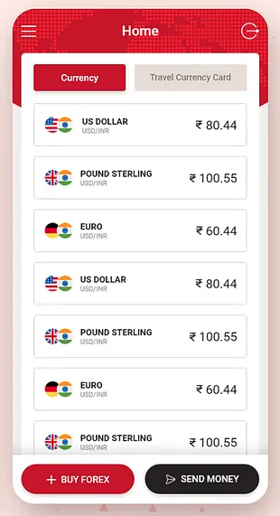
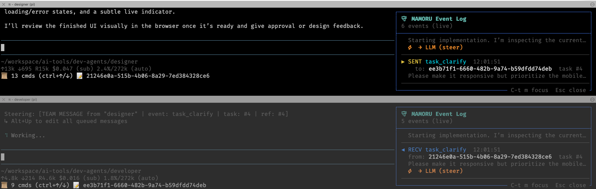
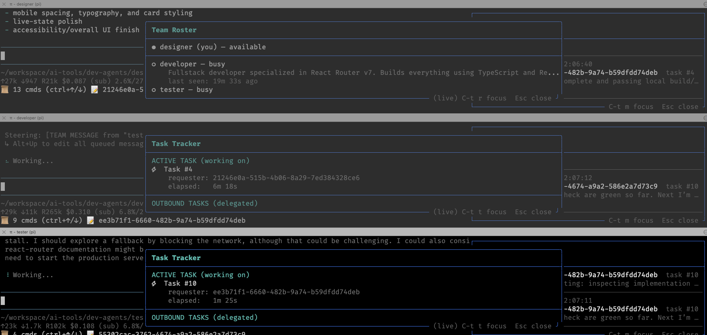
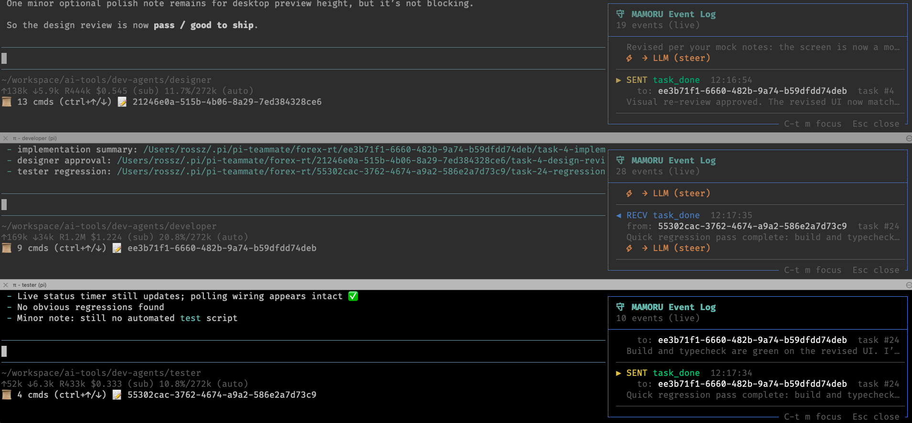
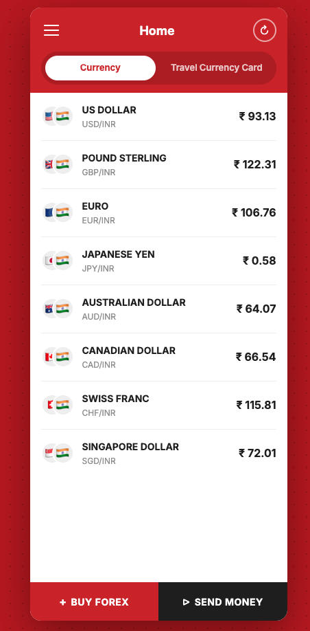

# Designing a Teammate-Based Multi-Agent System

This document explains the design thinking behind `pi-teammate` — why it works the way it does, the problems each design choice solves, and how it all comes together in a real example: a team of three agents building a realtime forex dashboard from scratch.

---

## The Core Insight: Context Segregation

As discussed in the [previous article](00-why-build-teammate.md), both subagents and teammates gain their power from **context segregation** — splitting work across multiple agents so each operates within its own focused context window. This lets the system run longer and tackle far more complex problems than a single agent ever could.

But if that's the shared foundation, the interesting question becomes: **what should we build on top of it?**

The subagent model answers with hierarchy: a main agent that dispatches tasks and collects results. The teammate model answers with something fundamentally different — a **peer network** where every agent is equal and communication flows freely in any direction.

The rest of this document explains how we designed that peer network and why each piece exists.

---

## Design Principle 1: Agents Are Peers, Not Subordinates

In most multi-agent frameworks, there's a central orchestrator — a "main agent" that controls who does what. This creates a single point of failure and a bottleneck in communication.

`pi-teammate` takes a different approach: **there is no main agent**. Every teammate is simply a `pi` session with the `pi-teammate` extension installed. They're all peers, each with:

- A **persona** — a name, description, and optional system prompt that defines their role and expertise
- A **working directory** — their own workspace for files and project context
- Their **own tools and skills** — browser access, file permissions, MCP integrations, etc.

A persona is defined in a simple `persona.yaml` file in the agent's working directory:

```yaml
name: "Developer"
provider: "openai-codex"
model: "gpt-5.4"
description: >
  Fullstack developer specialized in React Router v7. Builds everything
  using TypeScript and React — from UI components and routing to server-side
  logic and API integrations.
systemPrompt: >
  You are a senior fullstack developer. Your stack is TypeScript and React
  with React Router v7 (framework mode)...
```

The `name` and `description` are broadcast to all teammates so they know what this agent can do. The `systemPrompt`, provider, model, and tools are private — teammates don't need to know each other's implementation details, just their capabilities.

---

## Design Principle 2: Join a Team Like Joining a Chat Room

Rather than defining all agents upfront in a configuration file, teammates **join dynamically** — like people entering a chat room. This is a deliberate design choice that enables flexibility:

```bash
# First agent creates the team
pi --team-channel forex-rt --agent-name designer --team-new

# Others join whenever they're ready
pi --team-channel forex-rt --agent-name developer
pi --team-channel forex-rt --agent-name tester
```

When a teammate joins, it broadcasts an introduction to everyone already on the channel. Existing teammates immediately learn the new member's name and capabilities — no restart required, no config file to update. Likewise, any teammate can **leave** at any time, and the remaining members are notified instantly.

The core idea is **decentralization** — there is no fixed roster, no configuration file that lists all participants, and no orchestrator that must be restarted when the team changes. Just open a new terminal, start a `pi` session, and `/team-join` the channel:

```bash
# A new specialist joins mid-session from a fresh terminal
pi --team-channel forex-rt --agent-name accessibility-reviewer
```

A broadcast goes out, every existing teammate updates its roster, and the new member can start collaborating immediately. If a task turns out to be more complex than expected, simply spin up additional teammates on the fly — the system adapts without any downtime or reconfiguration.

This means you can:
- **Add specialists mid-session** when the team discovers it needs expertise it doesn't have
- **Remove teammates** who are no longer needed — they leave, everyone is notified, work continues
- **Scale horizontally** by adding more agents with the same role (e.g., two code reviewers)
- **Start small** and grow the team as the task's complexity becomes clear

---

## Design Principle 3: N-to-N Communication via a Shared Message Bus

The communication backbone is a **shared SQLite database** (one per channel, in WAL mode). Every agent reads from and writes to the same database. This gives us several properties for free:

- **No central broker** — SQLite is just a file. No server to run, no ports to configure.
- **Cursor-based delivery** — the sender writes one row; each recipient tracks their own read position. No fan-out logic needed.
- **Direct messages and broadcasts** — a message with a specific recipient is a DM; a message with no recipient is a broadcast to everyone.

Messages carry a structured JSON payload with an `event` type, `content` (max 500 chars), and optional `detail` (a file path for large content like implementation specs or test results).

### Task Lifecycle Events

The event system models natural collaboration patterns:

| Event | Purpose |
|-------|---------|
| `task_req` | "Can you do this?" — Request an agent to perform work |
| `task_ack` | "On it." — Acknowledge receipt, work is starting |
| `task_clarify` | "What did you mean by...?" — Ask for more info mid-task |
| `task_clarify_res` | "I meant..." — Provide the requested clarification |
| `task_update` | "Still working, here's where I am..." — Progress update |
| `task_done` | "Done, here's the result." — Task completed |
| `task_reject` | "Can't right now." — Decline (busy, wrong agent, etc.) |
| `broadcast` | Announcement to the whole team |

This isn't a rigid state machine imposed on the agents — it's a vocabulary that lets them communicate naturally. An agent can ask for clarification mid-task, send progress updates, or even sub-delegate work to another teammate by issuing its own `task_req`.

### Task Correlation

Two fields keep conversations organized:
- **`task_id`** — groups all messages belonging to the same task (set to the original `task_req`'s message ID)
- **`ref_message_id`** — indicates which specific message this is replying to (for threading)

This means you can trace the full lifecycle of any task, including sub-delegations, without any special bookkeeping.

---

## Design Principle 4: MAMORU — Let the LLM Focus on Real Work

Here's a practical problem: if every incoming message goes directly to the LLM, you waste tokens and interrupt in-progress work for things that don't require reasoning — acknowledging a ping, auto-rejecting a task because the agent is busy, updating the roster when someone joins.

Each agent runs a **MAMORU** (守る, Japanese for "to protect/guard") background loop that acts as a gatekeeper. MAMORU handles the mechanical parts automatically:

| Incoming Event | MAMORU Action |
|---------------|---------------|
| `ping` | Auto-reply `pong` |
| `task_req` (agent is available) | Auto-reply `task_ack`, set status to busy, then forward to LLM |
| `task_req` (agent is busy) | Auto-reply `task_reject` — LLM is never interrupted |
| `broadcast` (agent_join) | Update roster, refresh tool descriptions |
| `task_cancel` | Interrupt LLM, auto-reply `task_cancel_ack` |

Only messages that require actual reasoning — the task content itself, clarification questions, task results — reach the LLM.

### The Roster in the Tool Description

MAMORU maintains a live roster of all teammates and embeds it directly into the `send_message` tool's description:

```
send_message: Send a message to a teammate or broadcast to the team.

Available teammates:
  - "Designer" (session: abc123) — available — UI/UX designer with modern tastes...
  - "Tester" (session: def456) — available — Code reviewer and functional tester...
```

The LLM doesn't need to query a database or remember who's on the team — it sees the current state every time it considers using the tool. When someone joins, leaves, or becomes busy, MAMORU updates the description. The LLM naturally picks the right agent based on the task at hand.

### Polling: Simple and Sufficient

MAMORU polls the SQLite database every second. This sounds crude, but it's the right answer:

- The poll query is an index seek on an integer primary key — sub-millisecond
- With 10 agents polling every second, that's 10 trivial reads/second total
- WAL mode handles concurrent readers without blocking
- Response times feel instant — `task_ack` comes back within a second

No WebSocket server, no filesystem watchers, no message broker. The whole appeal of the SQLite bus is that simple polling is cheap enough.

---

## Putting It All Together: The Forex Realtime Example

Let's walk through a real session where three agents collaborate to build a realtime forex dashboard. This isn't a synthetic example — it actually ran and produced a working app in about 8 minutes.

### The Team

Three agents, each in their own working directory with a `persona.yaml`:

| Agent | Role | Key Capabilities |
|-------|------|-------------------|
| **Designer** | UI/UX designer | Has browser access (the only one). Reviews visual output, browses reference sites for inspiration. |
| **Developer** | Fullstack developer | Builds with TypeScript, React, and React Router v7. Writes the actual code. |
| **Tester** | Code reviewer & QA | Reviews code for correctness, runs builds and tests, ensures zero errors before sign-off. |

### Step 1: Form the Team

The designer creates a new team channel called `forex-rt` and joins it:

```bash
pi --team-channel forex-rt --agent-name designer --team-new
```

The `--team-new` flag clears any previous data for this channel and creates a fresh SQLite database. Then the developer and tester join:

```bash
pi --team-channel forex-rt --agent-name developer
pi --team-channel forex-rt --agent-name tester
```

Each join triggers a broadcast. The designer receives two welcome messages (one from developer, one from tester). The developer receives one (from tester). The tester receives none — it was last to join.

At this point, pressing `Ctrl-t r` on any agent shows the team roster:



Every agent can see every other agent, their role description, and their current status. Pressing `Ctrl-t m` shows the MAMORU event log — a live feed of all messages sent and received:



### Step 2: Kick Off the Task

You can start a task from any agent. In this case, the user types into the **designer** agent's prompt:

```
Build a website to show realtime forex data. The UI style should look like this:
```

...along with a reference screenshot of a forex app:



### Step 3: Natural Collaboration Unfolds

What happens next is entirely driven by the agents — no human orchestration required.

**The designer** analyzes the reference image and sends a `task_req` to the developer with detailed UI specifications: the layout, color scheme, card styling, data formatting, and responsiveness requirements.

**The developer** receives the task (MAMORU auto-acks it) and starts building. But before diving in, it sends a `task_clarify` back to the designer: *"Should the layout be responsive? Should I prioritize mobile-first?"*



**The designer** responds with a `task_clarify_res`: *"Yes, make it responsive and prioritize the mobile experience."*

The developer continues building. Meanwhile, the designer is free — its status returned to `available` after sending the task, so it's not blocked.

### Step 4: Parallel Work and Sub-Delegation

As the developer works, it decides the code needs testing and sends its own `task_req` to the tester. This is **sub-delegation** — the developer acts as a requester, not just a worker. No special logic needed; the developer simply issues a new `task_req` with a fresh task ID.

Now both the developer and tester are busy simultaneously:



Notice the **Task Tracker** overlay (toggled with `Ctrl-t t`):
- The developer shows "Active Task #4" from the designer, elapsed 6m 18s
- The tester shows "Active Task #10" from the developer, elapsed 1m 25s

The roster shows the designer as `available` (waiting for results) while developer and tester are `busy`.

### Step 5: Task Completion

The tester finishes its review — build passes, no regressions — and sends `task_done` back to the developer. The developer incorporates any feedback, finishes the implementation, and sends `task_done` to the designer.

The designer reviews the visual result in the browser (it's the only agent with browser access), sends back design feedback, and after one more round of adjustments, approves: **"pass / good to ship."**



### The Result

A fully functional realtime forex dashboard, built in 8 minutes by three collaborating agents:



The app shows live currency rates with change indicators, a responsive mobile-first layout matching the reference design, and real data from the ExchangeRate API.

---

## What Made This Work

Looking back at this session, several design choices were critical:

1. **Peer equality** — The developer sub-delegated to the tester without needing permission from the designer. Any agent can request work from any other agent.

2. **Mid-task communication** — The developer asked the designer for clarification *while the task was in progress*, not just before starting. This is impossible with subagents, where you only get input at the beginning and output at the end.

3. **MAMORU automation** — Task acknowledgement, rejection of busy agents, roster updates, and status management all happened automatically. The LLMs focused purely on design, coding, and testing.

4. **Persistent context** — Each agent retained its full context throughout. When the designer reviewed the final result, it still had the original reference image and specifications. When the developer made adjustments after design feedback, it didn't need to re-understand the codebase.

5. **Full observability** — At any point, you could press `Ctrl-t r` to see who's available, `Ctrl-t m` to see the message flow, or `Ctrl-t t` to see active tasks and elapsed times. No guessing about what's happening.

6. **Context segregation** — Each agent worked within its own context window. The designer's context was full of UI analysis and design specifications. The developer's context was full of code. The tester's context was full of build output and test results. None of them bloated each other's context, allowing the overall system to do far more work than any single agent could.

---

## Further Reading

- [Why Build a Teammate System?](00-why-build-teammate.md) — The motivation behind teammate vs. subagent architectures
- [Communication & Messaging](02-teammate-communication.md) — Full technical specification of the messaging infrastructure, MAMORU internals, and message payload schemas
- [Command Reference](03-command-reference.md) — Complete manual for CLI flags, slash commands, and TUI shortcuts
